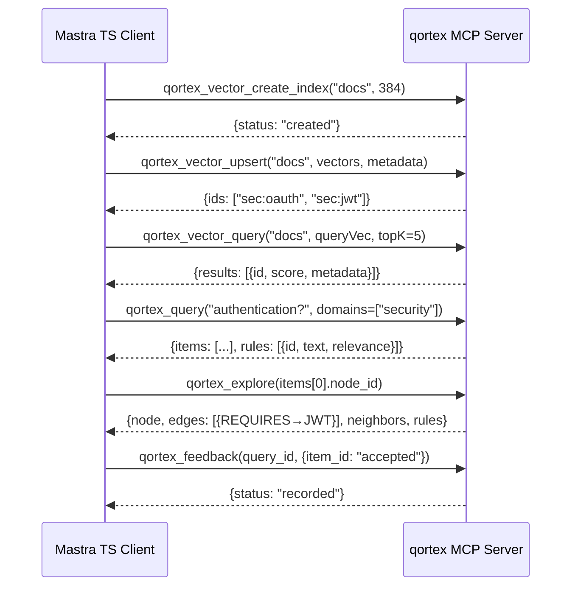

# Case Study: qortex as a Mastra Vector Store

> **Status**: E2E proven in `tests/test_e2e_mastra.py` (13 tests, real embeddings) and `tests/test_mastra_mcp_dogfood.py` (19 tests, graph-enhanced pipeline)

## Why Mastra

Mastra's `MastraVector` abstraction is one of the cleanest vector store interfaces in the ecosystem — 22 implementations, consistent API, great TypeScript DX. We use Mastra ourselves and wanted qortex to be a first-class citizen in that ecosystem.

The challenge: Mastra is TypeScript, qortex is Python. MCP bridges the gap beautifully. One config change gives any Mastra app access to qortex's graph-enhanced retrieval.

## How It Works

Every `MastraVector` method maps 1:1 to a qortex MCP tool:

| MastraVector Method | qortex MCP Tool |
|--------------------|-----------------|
| `createIndex(name, dimension)` | `qortex_vector_create_index` |
| `listIndexes()` | `qortex_vector_list_indexes` |
| `describeIndex(name)` | `qortex_vector_describe_index` |
| `deleteIndex(name)` | `qortex_vector_delete_index` |
| `upsert(indexName, vectors)` | `qortex_vector_upsert` |
| `query(indexName, queryVector, topK)` | `qortex_vector_query` |
| `updateVector(indexName, id, update)` | `qortex_vector_update` |
| `deleteVector(indexName, id)` | `qortex_vector_delete` |
| `deleteVectors(indexName, ids/filter)` | `qortex_vector_delete_many` |

On top of the standard API, qortex adds three capabilities that aren't part of MastraVector but complement it:

| Extra | What it does |
|-------|-------------|
| `explore(nodeId)` | Navigate typed edges and neighbors from any search result |
| `getRules(options)` | Query domain rules linked to concepts |
| `feedback(queryId, outcomes)` | Report what worked — improves future retrieval via PPR |

## The Swap

```typescript
import { QortexVector } from "@peleke.s/mastra-qortex";

// Before: const vectorStore = new PgVector({ ... });
// After:
const vectorStore = new QortexVector({
  id: "qortex",
  serverCommand: "uvx",
  serverArgs: ["qortex", "mcp-serve"],
});

// Everything you already do works unchanged
await vectorStore.createIndex({ indexName: "docs", dimension: 384 });
await vectorStore.upsert({ indexName: "docs", vectors: embeddings, metadata });
const results = await vectorStore.query({ indexName: "docs", queryVector, topK: 10 });

// And now you can also do this:
const explored = await vectorStore.explore(results[0].id);
await vectorStore.feedback(queryId, { [results[0].id]: "accepted" });
```

## The Full Pipeline



## What We Proved

| Claim | Evidence |
|-------|----------|
| MastraVector compliance | All 9 abstract methods implemented via MCP |
| Real embeddings | sentence-transformers/all-MiniLM-L6-v2 (384 dims), not mocks |
| Real semantic search | Query "How does OAuth2 work?" → top result contains OAuth2 |
| Graph exploration | query → node_id → explore → typed edges + neighbors + rules |
| Rules auto-surfaced | textQuery results include linked rules with relevance scores |
| Feedback loop | Query → accept/reject → recorded for future PPR weight adjustment |
| MongoDB-like filters | Equality, $ne, $gt, $lt, $in, $and, $or on metadata |
| JSON serializable | Every MCP response round-trips through JSON |

## What qortex Brings to the Table

Mastra's vector search is solid out of the box. qortex layers on graph structure for applications where relationships between concepts matter:

| Capability | How it works |
|-----------|-------------|
| Typed edges | Relationships extracted from source material (REQUIRES, REFINES, etc.) — not just cosine similarity |
| Persistent graph | Knowledge graph survives across sessions (SqliteVec + Memgraph) |
| PPR retrieval | Personalized PageRank over the graph — structurally relevant results, not just textually similar |
| Feedback learning | Teleportation factors adjust based on accept/reject signals |
| Rule surfacing | Domain rules linked to concepts appear automatically in results |
| Graph navigation | Traverse typed edges from any search result |
